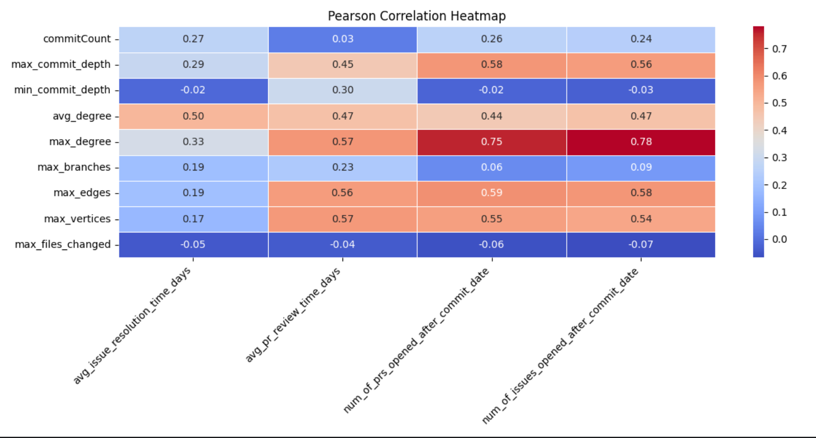
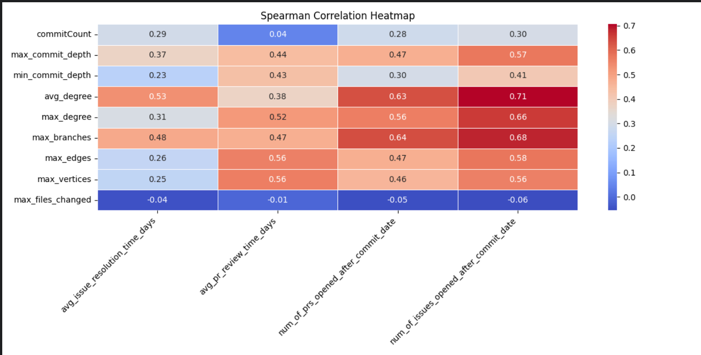
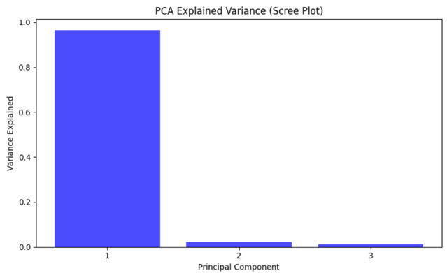
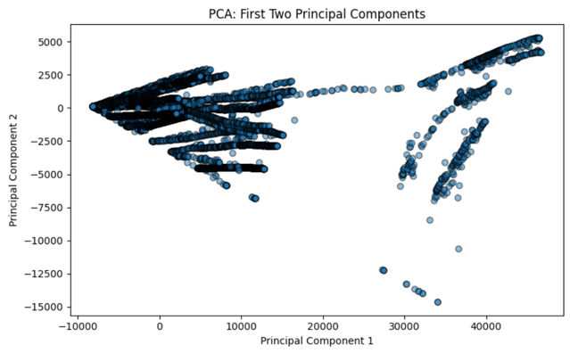
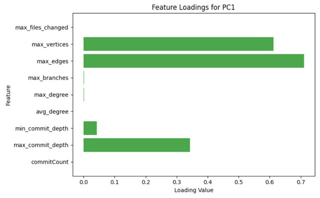
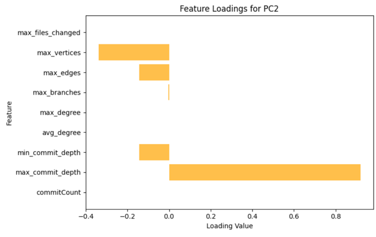
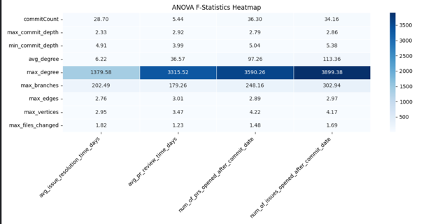
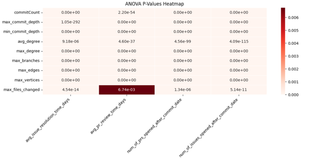

## 1. Correlation Analysis (Pearson & Spearman)

### Highly Correlated Features (Strong Positive Correlation, r > 0.5)

- **avg_degree vs. avg_issue_resolution_time_days**
  - Pearson: 0.4988
  - Spearman: 0.5318

- **max_degree vs. avg_pr_review_time_days**
  - Pearson: 0.5749
  - Spearman: 0.5170

- **max_commit_depth vs. num_of_prs_opened_after_commit_date**
  - Pearson: 0.5765
  - Spearman: 0.4732

- **max_degree vs. num_of_prs_opened_after_commit_date**
  - Pearson: 0.7536
  - Spearman: 0.5625

- **max_degree vs. num_of_issues_opened_after_commit_date**
  - Pearson: 0.7799
  - Spearman: 0.6598

#### Interpretation:
- Higher complexity in commit structures (max_commit_depth, max_degree, avg_degree) is strongly associated with longer issue resolution times and higher PR review times.
- More interconnected commit graphs (higher max_degree) correspond with more PRs and issues being opened after commit dates.
- The number of branches (`max_branches`) and number of edges (`max_edges`) are also positively correlated with issue and PR-related metrics.

### Negative Correlations

- **max_files_changed** has a weak negative correlation with most targets.

#### Interpretation:
- More changed files per commit might lead to faster issue resolution and PR review times, possibly because large commits are better structured or contain fixes for multiple issues.

### Low or Insignificant Correlations

- **min_commit_depth** shows weak correlation with issue resolution time.
  - Pearson: -0.0151
  - Spearman: 0.2335

#### Interpretation:
- The shallowest commit in a branch may not play a strong role in determining issue resolution speed.

---

## 2. Principal Component Analysis (PCA)

### Explained Variance

- **First component** explains 96.5% of variance, suggesting that most of the information is captured in the first principal component.
- **Second component** explains 2.1%.
- **Third component** explains 1.2%.

#### Interpretation:
- Most of the variability in the dataset comes from one dominant factor, possibly related to overall commit complexity (e.g., `max_commit_depth`, `max_degree`).

---

## 3. ANOVA Results

### Significant Features

- Features like `commitCount`, `max_commit_depth`, `min_commit_depth`, and `max_degree` have statistically significant effects (p-value ≈ 0.0) on targets.

#### Interpretation:
- Variations in these features significantly impact quality metrics, meaning different levels of these features result in substantial differences in issue resolution times, PR review times, and issue/PR creation rates.
{'avg_issue_resolution_time_days': {'commitCount': {'f_stat': 28.704490661496067, 'p_value': 0.0}, 'max_commit_depth': {'f_stat': 2.3274487056310424, 'p_value': 1.0467345097158141e-292}, 'min_commit_depth': {'f_stat': 4.906687834845193, 'p_value': 0.0}, 'avg_degree': {'f_stat': 6.222406352104617, 'p_value': 9.184265583587966e-06}, 'max_degree': {'f_stat': 1379.5823224270805, 'p_value': 0.0}, 'max_branches': {'f_stat': 202.4949924321311, 'p_value': 0.0}, 'max_edges': {'f_stat': 2.755951729047579, 'p_value': 0.0}, 'max_vertices': {'f_stat': 2.9475996251948073, 'p_value': 0.0}, 'max_files_changed': {'f_stat': 1.8213671879490752, 'p_value': 4.5415202299800203e-14}}, 'avg_pr_review_time_days': {'commitCount': {'f_stat': 5.443260107572381, 'p_value': 2.2025277367055844e-54}, 'max_commit_depth': {'f_stat': 2.9226694447011816, 'p_value': 0.0}, 'min_commit_depth': {'f_stat': 3.9941132121580813, 'p_value': 0.0}, 'avg_degree': {'f_stat': 36.569242264791434, 'p_value': 4.6042884417116744e-37}, 'max_degree': {'f_stat': 3315.524530415224, 'p_value': 0.0}, 'max_branches': {'f_stat': 179.2550535167993, 'p_value': 0.0}, 'max_edges': {'f_stat': 3.0066117115915776, 'p_value': 0.0}, 'max_vertices': {'f_stat': 3.471454552857606, 'p_value': 0.0}, 'max_files_changed': {'f_stat': 1.2347733012395612, 'p_value': 0.006741779216865787}}, 'num_of_prs_opened_after_commit_date': {'commitCount': {'f_stat': 36.303450629712174, 'p_value': 0.0}, 'max_commit_depth': {'f_stat': 2.7869613357310437, 'p_value': 0.0}, 'min_commit_depth': {'f_stat': 5.041415644130419, 'p_value': 0.0}, 'avg_degree': {'f_stat': 97.26044544071782, 'p_value': 4.56178038418239e-99}, 'max_degree': {'f_stat': 3590.2637306192805, 'p_value': 0.0}, 'max_branches': {'f_stat': 248.16004102393597, 'p_value': 0.0}, 'max_edges': {'f_stat': 2.890856024529561, 'p_value': 0.0}, 'max_vertices': {'f_stat': 4.2153660922094, 'p_value': 0.0}, 'max_files_changed': {'f_stat': 1.4780506056675822, 'p_value': 1.3425382266476645e-06}}, 'num_of_issues_opened_after_commit_date': {'commitCount': {'f_stat': 34.163965473343566, 'p_value': 0.0}, 'max_commit_depth': {'f_stat': 2.863938592071896, 'p_value': 0.0}, 'min_commit_depth': {'f_stat': 5.381551170963526, 'p_value': 0.0}, 'avg_degree': {'f_stat': 113.35733371040423, 'p_value': 4.092346137289233e-115}, 'max_degree': {'f_stat': 3899.3834003027328, 'p_value': 0.0}, 'max_branches': {'f_stat': 302.9449423249188, 'p_value': 0.0}, 'max_edges': {'f_stat': 2.969969858198799, 'p_value': 0.0}, 'max_vertices': {'f_stat': 4.173617439232531, 'p_value': 0.0}, 'max_files_changed': {'f_stat': 1.6927436401245186, 'p_value': 5.1362118749415003e-11}}}

---
